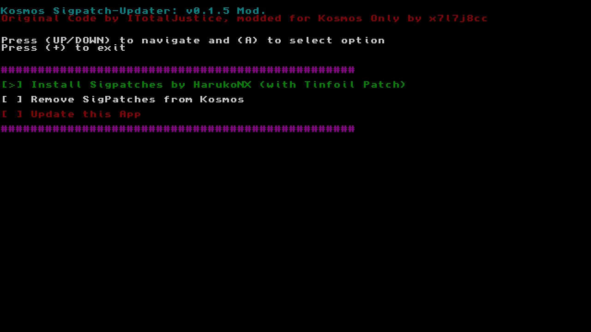

# ATTENTION

Since [Joonie](https://github.com/Joonie86) deleted the Repository on GitHub, the New [HarukoNX](https://github.com/HarukoNX/Atmosphere) SigPatches will be used.

----

# Kosmos Sigpatch-Updater
Original App by [ITotalJustice](https://github.com/ITotalJustice), ive only done some modification to Kosmos Only Users.

This update your Kosmos sigpatches, and currently it has the option to:

* Download patches from HarukoNX Git
* Remove SigPatches from Kosmos

----

# Where does it download the patches from?

The Hekate/Kosmos patches was downloaded from the [latest github release from Joonie](https://github.com/Joonie86/hekate/releases). Now its Directly downloaded from this Git.

The New [HarukoNX](https://github.com/HarukoNX/Atmosphere) SigPatches is downloaded from that new Git.

----

## Special Thanks!

[ITotalJustice](https://github.com/ITotalJustice) for the Sigpatch-updater

[toph](https://github.com/sudot0ph) for the design of the app icon!

Joonie for the continuing to update the hekate patches!

----

## Patreon

Feel free to support [ITotalJustice](https://github.com/ITotalJustice) on patreon!

